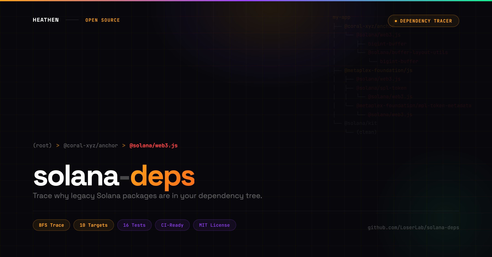

# solana-deps

<p align="center">
  
</p>

Trace why legacy Solana packages are in your dependency tree.

`solana-deps` scans your `package.json` and `package-lock.json` to find every path that pulls in deprecated Solana packages. It shows the full dependency chain so you know exactly which package is responsible and what to migrate to.

```
solana-deps v0.1.0

Scanned 42 packages (8 direct)

  Direct dependencies (1):

  @solana/web3.js v1
  Maintenance-mode. No new features, will stop receiving patches.
  Migrate to: @solana/kit (v2)

  Transitive dependencies (2):

  bigint-buffer
  CVE-2025-3194 buffer overflow. Abandoned native addon.
    (root) > @solana/web3.js > bigint-buffer
    (root) > @solana/web3.js > @solana/buffer-layout-utils > bigint-buffer
  Migrate to: bigint-buffer-safe (pure JS drop-in)

  @solana/buffer-layout-utils
  Pulls in bigint-buffer (CVE-2025-3194). Only needed for web3.js v1 patterns.
    (root) > @solana/web3.js > @solana/buffer-layout-utils
  Migrate to: @solana/codecs (part of Kit v2)

  Hotspots:
    @solana/web3.js pulls in bigint-buffer, @solana/buffer-layout-utils

3 legacy Solana packages found (1 direct, 2 transitive)
```

## Install

```bash
npm install -g solana-deps
```

## Usage

```bash
# Scan current directory
solana-deps

# Scan a specific project
solana-deps /path/to/project

# JSON output for CI/tooling
solana-deps --json

# Only show packages you installed directly
solana-deps --direct-only
```

## Programmatic API

```typescript
import { trace, formatHuman, formatJson } from "solana-deps";

const result = trace("/path/to/project");

console.log(formatHuman(result));
// or
console.log(formatJson(result));
```

### `trace(dir)` returns:

| Field | Type | Description |
|-------|------|-------------|
| `traces` | `TraceResult[]` | Each legacy package found |
| `traces[].target` | `Target` | Package info, reason, migration path |
| `traces[].chains` | `string[][]` | Every dependency path leading to it |
| `traces[].isDirect` | `boolean` | Whether you installed it directly |
| `hotspots` | `Hotspot[]` | Packages pulling in the most legacy deps |
| `totalDeps` | `number` | Total packages scanned |
| `directDeps` | `number` | Your direct dependency count |

## What it detects

| Package | Status | Migrate to |
|---------|--------|-----------|
| `@solana/web3.js` | Maintenance mode | `@solana/kit` (v2) |
| `bigint-buffer` | CVE-2025-3194 | `bigint-buffer-safe` |
| `@solana/buffer-layout-utils` | Pulls in CVE | `@solana/codecs` |
| `@project-serum/anchor` | Archived | `@coral-xyz/anchor` |
| `@project-serum/serum` | Defunct | `@openbook-dex/openbook-v2` |
| `@project-serum/sol-wallet-adapter` | Archived | `@solana/wallet-adapter-base` |
| `@solana/spl-token` | Legacy | `@solana-program/token` |
| `@metaplex-foundation/js` | Deprecated | `@metaplex-foundation/umi` |
| `@metaplex-foundation/mpl-token-metadata` | Legacy versions | v3+ with Umi |
| `@solana/wallet-adapter-react` | Built on v1 | `@solana/connector` |

## Exit codes

- `0` clean tree
- `1` legacy packages found

## Part of the Solana Migration Toolkit

Four tools that work together to get your project from web3.js v1 to Kit v2:

| Tool | What it does |
|------|-------------|
| **solana-deps** (this tool) | Trace why legacy packages are in your tree |
| [solana-audit](https://github.com/LoserLab/solana-audit) | Catch CVEs and deprecated APIs that `npm audit` misses |
| [solana-codemod](https://github.com/LoserLab/solana-codemod) | Auto-migrate code from web3.js v1 to Kit v2 |
| [bigint-buffer-safe](https://github.com/LoserLab/bigint-buffer-safe) | Drop-in CVE fix for bigint-buffer |

**Recommended workflow:** `solana-deps` (find what's legacy) -> `solana-audit` (check for vulnerabilities) -> `solana-codemod` (fix the code) -> `solana-audit` (verify the result).

## Author

Created by [**Heathen**](https://x.com/heathenft)

Built in [Mirra](https://mirra.app)

## License

MIT License

Copyright (c) 2026 Heathen
